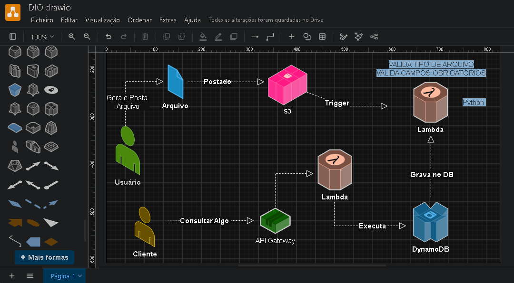

# Desafio_Executando_Tarefas_Automatizadas_com_Lambda_Function_S3.
** Desafio DIO: Processamento de Arquivos com S3, Lambda e DynamoDB.

---
**Repositório foi criado para entregar o:  `Desafio prático de automação na AWS` do curso: `Formação AWS Cloud Foundations` da **Digital Innovation One (DIO)**.
- Aulas ministradas pelo Prefessor: `Alexsandro Lechner`. `Arquiteto de Soluções AWS`.
---
**Resumo das aulas: 
- Automação e DevOps na AWS. Tarefas com Lambda e S3.
- Amazon S3: serviço de "armazenamento" (vídeo, áudio, docs imagens, etc ) em nuvem da AWS.
- Principais vantagens do S3: Durabilidade: altamente confiável com redundância para proteger contra falhas. Disponibilidade: grande acesso contínuo aos dados. Escalabilidade: ajusta automaticamente a capacidade de armazenamento conforme a necessidade. Segurança: oferece criptografia, controle de acesso e monitoramentos de atividades.
- AWS Lambda é um serviço de computação serveless, permite executar códigos sem a necessidade de gerenciar servidores. Fazer upload do código e o lambda se encarrega de executar automaticamente, escalando de acordo com a demanda.
 -Tarefas com Lambda e S3. Principais vantagens do Lambda: Execução sob demanda, o código é executado apenas quando necessário. Escalabilidade automática: Ajusta a capacidade automaticamente com base no número de eventos. Custo eficiente: Cobra apenas pelo tempo de execução e pela quantidade de solicitações. Integração com outros serviços AWS: Funciona como um conector entre diversos serviços, como S3, DynamoDB, API Gateway.
- Importante: `execução por evento ou seja pequenas execuções`.
- `Lambda Function é robusto, mas recomendação segundo o professor não trabalhar como microsserviço`.
- AWS Local com LocalStack: Projeto OpenSource que ajuda a simular localmente a AWS.
---
## 💡 HandsOn: como foi feito no projeto?

A ideia central do projeto é criar um fluxo automático sem a necessidade de gerenciar servidores *Serverless*:

1. `**Envio do arquivo:**` O usuário faz o upload de um arquivo `.json` no bucket do `**Amazon S3**`.
2. `**Gatilho (Trigger):**` Assim que o S3 recebe o arquivo, ele avisa o `**AWS Lambda**` de forma automática.
3. `**Processamento:**` O `**AWS Lambda**` lê as informações que estavam dentro do arquivo.
4. `**Banco de dados:**` A função grava esses dados em uma tabela do `**Amazon DynamoDB**`.
5. `**Permissões:**` O `**AWS IAM**` cuida para que o Lambda tenha acesso seguro ao **S3** e ao **DynamoDB**.
6. `**AWS CloudFormation:**` Para criar a infraestrutura através de código `**(IaC)**` e deixar o processo rápido e repetível.
7. `**[Diagrama feito no Draw.io:]**` (https://app.diagrams.net/).
   
   

---

## 🛠️ Tecnologias e Ferramentas Utilizadas

- **Amazon S3:** Para guardar os arquivos enviados.
- **AWS Lambda:** Para rodar o código de processamento automaticamente.
- **Amazon DynamoDB:** Banco de dados para salvar os registros.
- **AWS IAM:** Gerenciamento de acessos e segurança.
- **AWS CloudFormation:** Para subir toda essa estrutura de uma vez só por código.
- **[localstack:]** (https://localstack.cloud/) Ferramenta para simular o ambiente da AWS no próprio computador e testar tudo sem gastar nada.
- **[Draw.io:]** (https://app.diagrams.net/) Usado nas aulas para desenhar e visualizar o diagrama da arquitetura.
- **[Github:]** Para subir os arquivos do projeto.

---

## 🧠 Principais Aprendizados e Insights

- **Entendimento de eventos:** Percebi como os serviços da nuvem conversam entre si. Não preciso de uma máquina ligada 24 horas; o código só roda quando o arquivo chega.
- **Infraestrutura como Código:** Criar os recursos direto no CloudFormation economiza muito tempo e evita erros manuais no painel da AWS.
- **Testes Locais:** Usar o **LocalStack** facilitou muito o aprendizado, pois pude errar e testar os comandos pelo terminal sem medo de gerar custos na conta da AWS.

---

## 🤝 Conecte-se comigo!

Gostou do projeto ou quer trocar ideias sobre estudos em Cloud, AWS e tecnologia? Vamos nos conectar:

- **GitHub:** [HigorCamposGit](https://github.com/HigorCamposGit)

---
